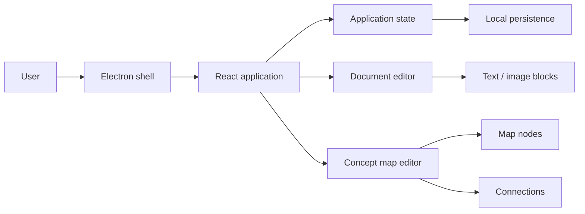

# Nexo Note

**Desktop study workspace for notes, visual documents and interactive concept maps.**

Nexo Note is a personal productivity project designed to make study material more visual and structured than a traditional linear note-taking app. It combines hierarchical organization, editable note sheets, images and interactive concept maps in a desktop-first workspace.

> **Portfolio repository.** This is a curated public snapshot of the project. The original development repository remains private. The source files included here are copied unchanged and selected to show the most representative parts of the implementation.

## Highlights

- Desktop application built with **React, TypeScript, Vite and Electron**
- Hierarchical organization of study directories and documents
- Editable text and image blocks
- Interactive concept maps with draggable nodes
- Configurable node shapes, colors and connection styles
- Rich-text editing controls
- Local application-state persistence
- Cross-platform desktop packaging with Electron Builder

## Architecture

## Tech stack

| Area | Technologies |
| --- | --- |
| Frontend | React 18, TypeScript |
| Tooling | Vite |
| Desktop runtime | Electron |
| Packaging | electron-builder |
| State | Custom React state/store |
| Visual editing | SVG / DOM based interactions |

## Public source snapshot

The `showcase/` directory contains representative pieces of the real codebase:

- `components/map/mapEditor.tsx` — orchestration of concept-map interactions
- `components/map/mapNodesScene.tsx` — node rendering and manipulation
- `components/map/mapConnectionsView.tsx` — visual connection layer
- `components/editor/textToolbar.tsx` — rich-text controls
- `components/layout/sidebar.tsx` — workspace navigation
- `state/store.ts` — application state and persistence logic
- `types/models.ts` — domain models
- `electron/main.cjs` — desktop shell configuration

Generated artifacts, duplicated legacy code and non-essential media assets are intentionally excluded from this portfolio snapshot.

## What this project demonstrates

Nexo Note was developed as an end-to-end product rather than an isolated frontend exercise. It demonstrates UI architecture, domain modelling, state management, visual editors, desktop packaging and the implementation of non-trivial interactions.

## Status

Personal project · portfolio showcase. Development continues in a private repository.
