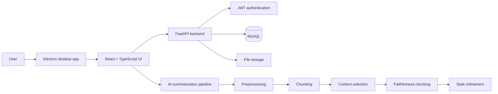
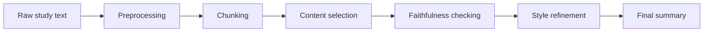

# Nexo Note

**Full-stack AI-powered study workspace for structured notes, visual documents and concept maps.**

Nexo Note is a personal productivity project designed around a simple idea: study material should not be limited to linear text. The application combines desktop note-taking, document organization, visual concept maps, persistent user state and an AI summarization pipeline.

> **Portfolio repository.** This is a curated public snapshot of the project. The original development repository remains private. The source files included here are copied unchanged and selected to show the most representative parts of the implementation.

## Highlights

- Desktop application built with **React, TypeScript, Vite and Electron**
- **FastAPI** backend with REST APIs
- Authentication with **JWT**
- Persistent application state with **SQLAlchemy + MySQL**
- Streaming upload/download for large files
- Interactive concept maps with draggable nodes and configurable connections
- Rich-text and image-based note editing
- Cross-platform desktop packaging
- Five-stage AI summarization pipeline:
  1. preprocessing
  2. chunking
  3. content selection
  4. faithfulness checking
  5. style refinement

## Architecture

## Tech stack

| Area | Technologies |
| --- | --- |
| Frontend | React 18, TypeScript |
| Desktop runtime | Electron |
| Tooling | Vite |
| Backend | FastAPI, Python |
| Persistence | SQLAlchemy, MySQL |
| Authentication | JWT |
| AI / NLP | PyTorch, Transformers, Hugging Face ecosystem |
| Packaging | electron-builder |

## Public source snapshot

The `showcase/` directory contains representative parts of the real codebase.

### Frontend / desktop

- `showcase/src/react/components/map/mapEditor.tsx` — concept-map interaction orchestration
- `showcase/src/react/components/map/mapNodesScene.tsx` — visual node rendering and manipulation
- `showcase/src/react/components/map/mapConnectionsView.tsx` — connection rendering
- `showcase/src/react/components/editor/textToolbar.tsx` — rich-text controls
- `showcase/src/react/state/store.ts` — application state and persistence logic
- `showcase/src/react/types/models.ts` — domain models
- `showcase/electron/main.cjs` — desktop shell configuration

### Backend

- `showcase/backend/appunti_backend/main.py` — FastAPI application entry point
- `showcase/backend/appunti_backend/api/routes/auth.py` — authentication endpoints
- `showcase/backend/appunti_backend/api/routes/files.py` — file upload/download endpoints
- `showcase/backend/appunti_backend/core/security.py` — JWT/password security utilities
- `showcase/backend/appunti_backend/db/models.py` — SQLAlchemy persistence models
- `showcase/backend/pyproject.toml` — backend dependencies and packaging

### AI summarization

- preprocessing
- semantic-aware chunking
- content-selection stage
- faithfulness checking
- style refinement
- end-to-end pipeline runner

Representative implementation lives under `showcase/ai/`.

## AI pipeline

The pipeline is modular so individual stages can be evaluated and replaced independently. The project includes real-model paths and controlled fallbacks for development/testing.

## What this project demonstrates

Nexo Note combines product engineering and applied AI in a single system:

- desktop application architecture
- full-stack API design
- authentication and persistence
- rich interactive editors
- data modelling and state synchronization
- modular NLP pipelines
- model integration and evaluation-oriented design

Generated builds, datasets, checkpoints, private configuration, development artifacts and non-essential media are intentionally excluded from this public portfolio snapshot.

## Status

Personal project · portfolio showcase. Active development continues in a private repository.
