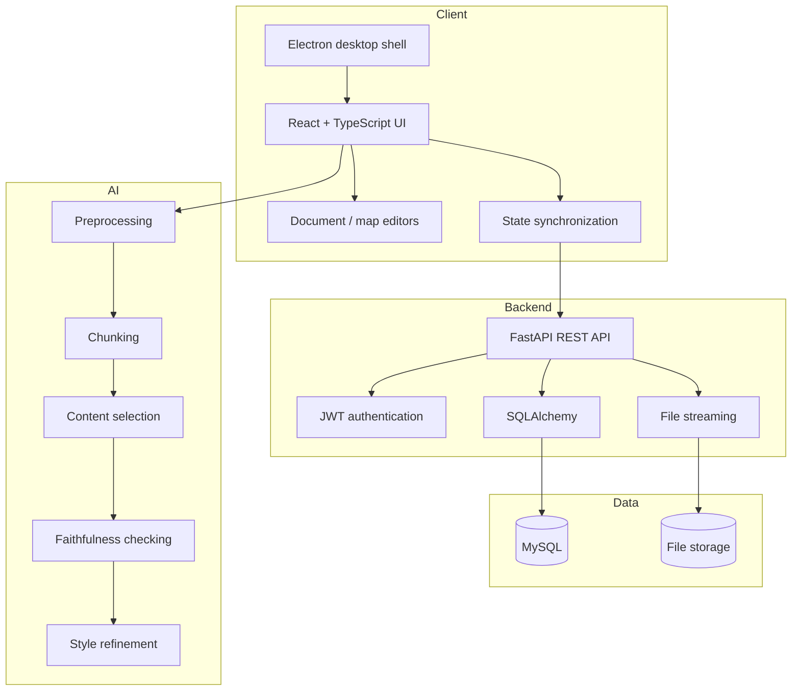

# Architecture

Nexo Note is structured as a desktop-first, full-stack application with a separate AI/NLP subsystem.

## System overview

## Frontend

The desktop client uses Electron as the runtime shell and React/TypeScript for the application UI. The frontend models folders, documents, sheets, image blocks, map nodes, links, selections and toolbar state.

The visual editing layer separates map orchestration, node rendering and connection rendering into dedicated components.

## Backend

The backend is a FastAPI service with:

- REST endpoints
- JWT-based authentication
- SQLAlchemy ORM models
- MySQL persistence
- application-state synchronization
- streaming upload/download for large files
- optional HTTPS for local deployment

The public snapshot intentionally excludes real deployment configuration and private runtime state.

## AI subsystem

The summarization subsystem is designed as five independent stages:

1. **Preprocessing** — text cleanup and normalization
2. **Chunking** — partitioning long study material
3. **Content selection** — selecting/summarizing relevant information
4. **Faithfulness checking** — checking generated summaries against source content
5. **Style refinement** — rewriting the final text into the requested style

An end-to-end runner composes the stages while keeping them individually testable and replaceable.

## Portfolio scope

This repository is not a mirror of the private development repository. It is a curated engineering showcase.

Included:
- representative production source code
- backend architecture
- AI pipeline implementation
- architecture documentation

Excluded:
- datasets and checkpoints
- generated builds
- private environment files
- temporary experiments
- local machine artifacts
- duplicated legacy code

All source files copied into `showcase/` are kept functionally unchanged from the original project snapshot.
