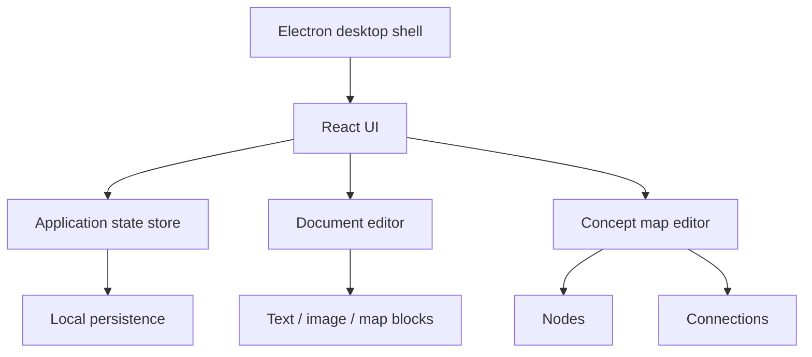

# Architecture

Nexo Note uses a desktop-first architecture with Electron as the application shell and React as the UI layer.

## Main responsibilities

**Electron shell** hosts the desktop application with context isolation, Node integration disabled and sandboxing enabled.

**React UI** manages the workspace, directories, document editing and concept-map interactions.

**State layer** models folders, documents, blocks, map nodes, links, selections and toolbar state. It also normalizes legacy state before loading it.

**Visual editor** separates map orchestration, node rendering and connection rendering into dedicated components.

## Portfolio scope

This public repository intentionally contains a representative subset of the source code rather than the complete private development history. Source files in `showcase/` are copied without functional modifications.
